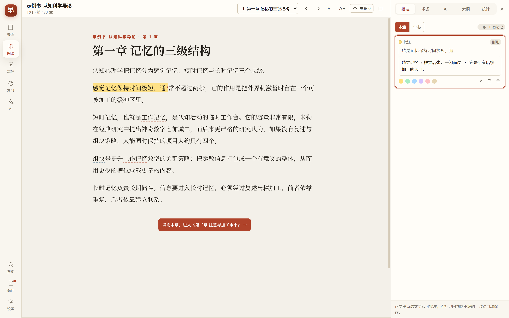
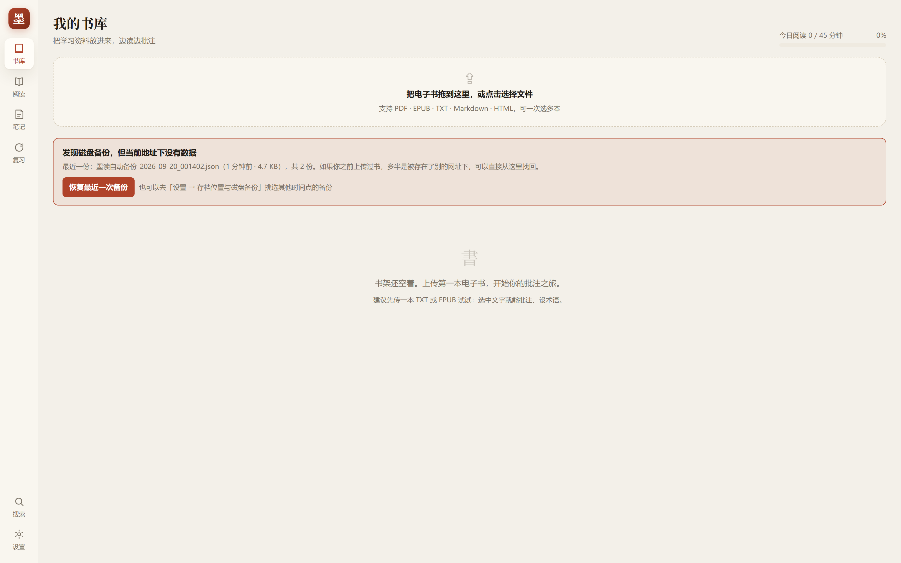
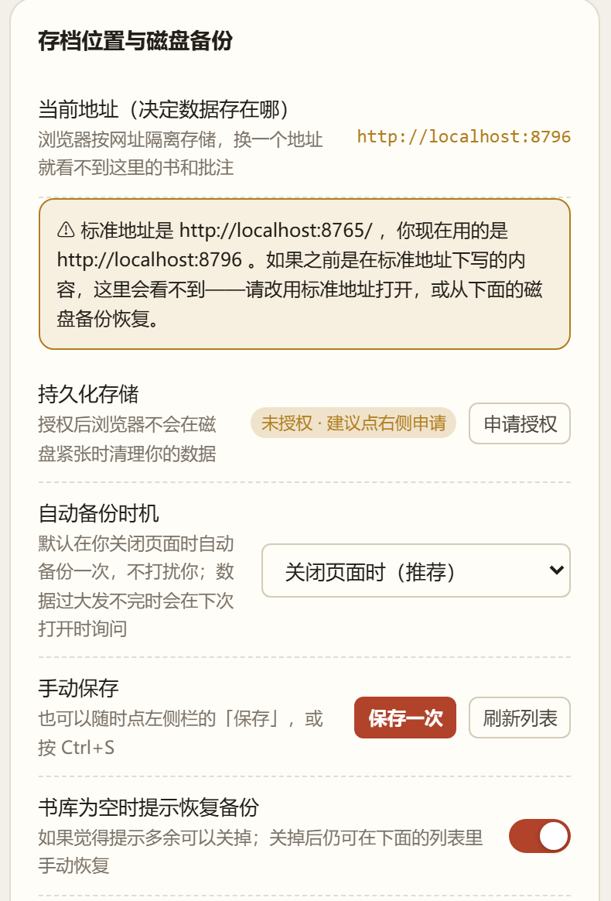

# 墨读 InkMark

> 电子书实时批注与知识整理工作台 · 纯本地运行，不需要安装，不需要联网

[](https://github.com/liulongxin999-ctrl/inkmark/actions/workflows/ci.yml)
[](LICENSE)

把「读电子书」和「做笔记」合成一件事：读到哪、批到哪；批注、术语、笔记三者互相连通，
右侧栏原地改、正文即时变，全部数据只存在你自己的电脑里。



---

## 30 秒上手

1. 双击 **`启动.bat`**（会自动打开浏览器；没有 Node 就用 Python，两者都没有也能直接打开 index.html，但部分功能受限）
2. 把 `示例/示例书-认知科学导论.txt` 拖进书库——建议先用它试一遍
3. 打开这本书，**选中任意一句话** → 浮出工具条 → 点「高亮」或「写批注」
4. 选中一个专业名词（比如「组块」）→ 点 **「设为术语」** → 填上定义
5. 之后全书里这个词都会自动高亮：**鼠标悬停看释义，点击在右侧栏编辑**
6. 顶部「笔记」进笔记工作台，卡片可在四列之间拖动；「复习」按遗忘曲线抽卡

**带公式和插图的资料怎么读？** 把 `.md` 和 `images/` 文件夹打包成 `.zip` 拖进书库（或点「选择文件夹」）：
`$...$` 公式会**渲染成真正的数学排版**，插图会**真正显示**并可点击放大。
扫描版 PDF（没有文字层）需要先自行做一次 OCR 转成 Markdown，再按上面的方式打包成 zip 导入。

---

## 快捷键

| 按键 | 作用 |
| --- | --- |
| `Ctrl / ⌘ + K` | 命令面板：跳书、跳章节、搜术语笔记、执行命令 |
| `Ctrl / ⌘ + S` | 保存（把这次做的改动写进磁盘备份） |
| `H` | 高亮选中文字 |
| `U` | 加下划线 |
| `N` | 写批注并自动打开侧栏 |
| `T` | 把选中的词设为术语 |
| `B` | 在当前位置加书签 |
| `J` / `K` | 下一章 / 上一章 |
| `Esc` | 关闭弹窗、工具条、气泡 |

---

## 数据与隐私

- 所有内容存放在浏览器的 **IndexedDB** 里，不联网、不上传。
- **数据跟网址绑定**：`http://localhost:8765/` 和 `http://localhost:8766/` 在浏览器眼里是两个不同的网站，
  存档互不相通。所以请始终用「启动.bat」打开，不要手动改端口。
- **保存**：像写文档一样。左侧栏有一个常驻的 **保存** 按钮，有未保存改动时会亮起小红点，
  按 `Ctrl+S` 也一样。点一下就把这次做的全部内容写进 `backups/`（保留最近 12 份）。
- **自动保存时机**可在设置里选：**关闭页面时保存一次**（默认，不打扰你）、每小时一次、或仅手动。
  关闭页面时如果数据太大（浏览器只允许在关闭页面时发送 64KB 以内），会自动记下来，
  **下次打开时问你**要不要补一次保存。
- 换网址、清浏览器数据、换浏览器都能从 `backups/` 恢复——打开时如果发现
  「当前地址没数据但磁盘有备份」，书库页会直接提示一键恢复，可「本次忽略」或「永久忽略」。
- 「设置 → 数据」可导出 **JSON 完整备份** 与 **Markdown 打包（zip）**，也可随时导入还原。
- 原文件（PDF/EPUB）会一并留档，用于「原版页」渲染与批注导出；超大文件可能无法留档，不影响正文批注。
- 本地服务只监听 `127.0.0.1`，同一 Wi-Fi 下的其他设备访问不到。

### 书库突然空了怎么办

按可能性从高到低排查：

1. **看地址栏**：必须是 `http://localhost:8765/`。如果端口不是 8765，说明当时被别的程序占了端口，
   你的数据在另一个地址下——双击 `找回旧存档.bat`，输入那个端口把书导出，再回 8765 导入。
2. **看设置页**：「设置 → 存档位置与磁盘备份」会显示当前地址、备份状态与备份列表，
   点「恢复」可以直接把某一时刻的备份还原回来。
3. **书库页的提示**：如果磁盘上有备份，空书库会自动出现「恢复最近一次备份」按钮，直接点即可。
4. 如果用的是浏览器的**无痕/隐私窗口**，关闭窗口后数据一定会被清除，请改用普通窗口。





---

## 目录结构

```
墨读/
  index.html                应用骨架
  启动.bat                  一键启动本地服务并打开浏览器
  找回旧存档.bat            在指定端口启动，用来把旧地址下的书搬运回标准地址
  提交并推送.bat            自检 → 提交 → 推送，一步完成
  server.mjs                零依赖本地静态服务器（带端口自动避让）
  backups/                  自动生成的磁盘备份（已被 .gitignore 忽略）
  示例/                     示例书，可直接拖进书库
  docs/screenshots/         界面截图
  .github/workflows/ci.yml  推送后自动跑自检与端到端测试
  assets/styles/            base 设计系统 · reader 正文与标记 · panels 面板与卡片
  assets/vendor/            pdf.js · JSZip · marked（已本地化，离线可用）
  assets/vendor/katex/      KaTeX 公式渲染引擎（含 20 个字体，离线可用）
  src/core/                 utils 工具 · db 数据库 · store 状态中枢
  src/import/               parsers 五种格式解析（含 GBK 识别、PDF 版面还原）
  src/reader/               anchors 锚定与分段 · marks 标记渲染 · selection 选区交互 · reader 阅读视图
  src/panels/               sidebar 批注 / 术语 / 大纲 / 统计
  src/views/                library 书库 · notes 笔记工作台 · review 复习
  src/ui/                   shell 主题 / 弹窗 / 命令面板 / 数据导入导出
  tests/                    自检与端到端测试
```

---

## 技术要点

**批注不存 HTML，只存偏移量。** 每条批注只记录 `{块 ID, 起始, 结束, 原文, 前文, 后文}`。
即使改字体、换主题、换设备，批注也不会错位；文字有微小变动时，会用前后文模糊回退重新定位。

**一次边界扫描完成所有标记渲染。** 把「批注区间」与「术语匹配区间」合并成一条边界序列，
切成互不重叠的最小片段，所以重叠批注、术语与批注交叠、跨段落拆分都能正确显示，
且片段文本首尾相接严格等于原文——这保证了字符偏移永远有效。

**写入单点出口。** 所有写库都经过 `store.js`，落盘成功后再广播事件，
配合 `BroadcastChannel` 让多个标签页实时同步。

**公式是「原子单元」。** 公式用 KaTeX 渲染成真正的数学排版，但在底层，
每个公式节点仍按它的 LaTeX 源码长度参与字符偏移计算——
所以「文字 + 公式」混排的段落，划选与批注锚点依然与原文严格一致。

**插图存在本地。** zip / 文件夹导入时，图片以 Blob 形式存进 IndexedDB，
渲染时换成对象地址，换书或删书时自动释放。

---

## 开发者命令

```bash
node tests/check-imports.mjs    # 静态检查：导入导出是否匹配
node tests/run-headless.mjs     # 71 项运行时自检（无头浏览器，真实 IndexedDB）
node tests/smoke.mjs            # 22 步端到端：上传 → 划选批注 → 术语 → 笔记 → 刷新持久化
node tests/persistence.mjs      # 存档验证：关闭浏览器 / 强制杀进程后数据是否还在
node tests/backup.mjs           # 磁盘备份与「换浏览器后一键恢复」验证
node tests/backup-timing.mjs    # 保存按钮 / Ctrl+S / 关闭时保存 / 数据过大时的询问流程
node tests/render-rich.mjs      # 公式渲染 / zip 导入插图 / 跨公式批注锚点是否准确
node tests/server-ports.mjs     # 端口策略：绝不静默换端口（防止存档看不见）
node tests/production-path.mjs  # 生产路径与安全边界：备份接口的访问控制、目录穿越防护
node tests/shots.mjs [输出目录] # 自动截图主要界面，用于视觉验收
node server.mjs 8765 --open     # 启动本地服务
```

代码为原生 ES Modules，**没有构建步骤**，改完刷新浏览器即可生效。
运行应用只需任意版本的 Node.js；跑上面这些自动化测试需要 **Node.js 22+**（用到了内置 WebSocket）。

### 日常改动的推荐流程

**最简单的方式**：改完代码后双击 `提交并推送.bat`——它会先跑快速自检，再让你写一句改动说明，然后自动提交并推送到 GitHub。

**手动方式**：

```bash
node tests/check-imports.mjs        # 可选的快速自检
git add -A
git commit -m "feat: 说明这次改了什么"
git push
```

推送后 GitHub Actions 会自动跑完整测试（配置见 `.github/workflows/ci.yml`），
在仓库页面的 **Actions** 标签里能看到结果；绿色代表这次改动没有破坏已有功能。

---

## 已知限制

- 扫描版 PDF 没有文字层，正文无法提取，只能用「原版页」按原始排版阅读；想变成可批注的文字，需要先自行做 OCR 转换。
- EPUB 中的插图暂以占位符呈现；Markdown 的插图需要以 zip / 文件夹方式导入才会显示。
- 公式是整体单元，不能在一个公式内部逐字划线（可以整条选中、批注、设为术语）。
- 复习算法是简化版 SM-2（忘了 / 模糊 / 记住三档），够用但不追求最优排程。
- 单本书建议在 300 万字以内；超大文件首次解析需要等待进度条走完。

---

## 许可证

本项目基于 [MIT License](LICENSE) 开源，你可以自由使用、修改、分发，包括用于商业用途，
只需保留版权声明即可。

第三方依赖（`assets/vendor/`）各有其自身许可证：

- [PDF.js](https://github.com/mozilla/pdf.js) — Apache-2.0
- [JSZip](https://github.com/Stuk/jszip) — MIT / GPLv3 双许可
- [marked](https://github.com/markedjs/marked) — MIT
